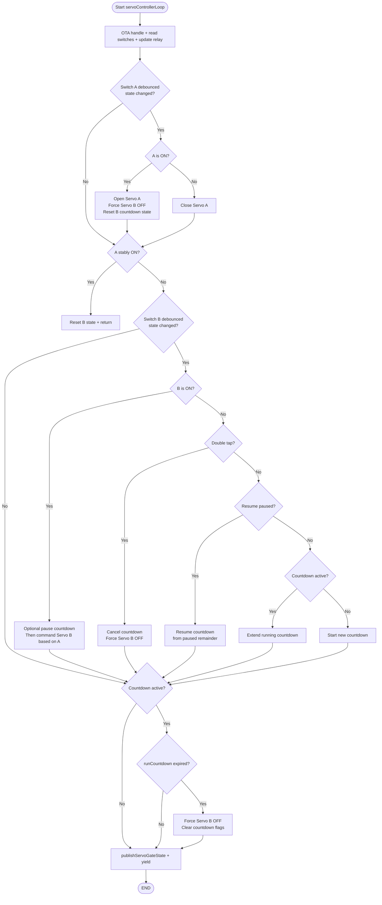

# servoControllerLoop() — Flowchart

**Source:** `src/ControllerTasks.cpp:179`

```mermaid
flowchart TD

    START([servoControllerLoop]) --> OTA["ArduinoOTA.handle()\nyield()"]
    OTA --> READ["readingA = digitalRead(switchPinA)\nreadingB = digitalRead(switchPinB)\nlogSwitchStates()\nupdateRelayFromServoStates()"]

    READ --> DA1{"readingA !=\nlastReadingA?"}
    DA1 -- Yes --> RTA["lastDebounceTimeA = millis()"]
    DA1 -- No  --> DWA
    RTA --> DWA

    DWA{"Switch A debounce\nwindow elapsed?"} -- No  --> LRA
    DWA -- Yes --> ASC{"readingA !=\nlastStableStateA?"}
    ASC -- No  --> LRA
    ASC -- Yes --> USA["lastStableStateA = readingA\nlogSwitchStates(A change)"]

    USA --> AON{"lastStableStateA\n== SWITCH_ON?"}

    AON -- Yes --> AOPEN["setGateState(STATE_OPENING)\ncommandServoA(true)\ntrace = ON, displayStat()\ncommandServoB(false)\nlastReadingB = digitalRead(switchPinB)\ncountdownActiveB = false\nresumeCountdownOnBHigh = false\npausedRemainingB = 0"]

    AON -- No  --> ACLOSE["commandServoA(false)\ntrace = OFF\ndisplayStat()"]

    AOPEN --> LRA["lastReadingA = readingA"]
    ACLOSE --> LRA

    LRA --> AHIGH{"lastStableStateA\n== SWITCH_ON?"}

    AHIGH -- Yes --> LOCKB["countdownActiveB = false\nresumeCountdownOnBHigh = false\npausedRemainingB = 0\nlastDisplayedRemainingSec = -1\nlastDebounceTimeB = millis()\nlastReadingB = readingB\nlastStableStateB = readingB\nyield()"]
    LOCKB --> RET([return])

    AHIGH -- No --> DB1{"readingB !=\nlastReadingB?"}
    DB1 -- Yes --> RTB["lastDebounceTimeB = millis()"]
    DB1 -- No  --> DWB
    RTB --> DWB

    DWB{"Switch B debounce\nwindow elapsed?"} -- No  --> LRB
    DWB -- Yes --> BSC{"readingB !=\nlastStableStateB?"}
    BSC -- No  --> LRB
    BSC -- Yes --> USB["lastStableStateB = readingB\nlogSwitchStates(B change)"]

    USB --> BON{"lastStableStateB\n== SWITCH_ON?"}

    %% ── B went HIGH (ON) ───────────────────────────────────────────────────
    BON -- Yes --> BPAUSE{"countdownActiveB?"}

    BPAUSE -- Yes --> SAVCD["elapsed = (millis() - countdownStartB) / 1000\nremaining = countdownDurationB - elapsed\npausedRemainingB = remaining\nresumeCountdownOnBHigh = true"]
    BPAUSE -- No  --> STOPCD

    SAVCD --> STOPCD["countdownActiveB = false"]

    STOPCD --> ASTATE{"lastStableStateA\n== SWITCH_OFF?"}
    ASTATE -- Yes --> BOPEN["setGateState(STATE_OPENING)\ncommandServoB(true)\ntrace = ON, displayStat()"]
    ASTATE -- No  --> BCLOSE1["commandServoB(false)\ntrace = OFF, displayStat()"]

    BOPEN  --> LRB
    BCLOSE1 --> LRB

    %% ── B went LOW (OFF) ───────────────────────────────────────────────────
    BON -- No --> DTCALC["now = millis()\ndoubleTap = (lastBHighTime != 0)\n  && (now - lastBHighTime < bDoubleTriggerMs)\nlastBHighTime = now"]

    DTCALC --> DT{"doubleTap?"}

    DT -- Yes --> DTCLOSE["countdownActiveB = false\ncountdownDurationB = 0\nresumeCountdownOnBHigh = false\npausedRemainingB = 0\ncommandServoB(false)\nlastDisplayedRemainingSec = -1\ntrace = OFF, displayStat()"]
    DTCLOSE --> LRB

    DT -- No --> RESUME{"resumeCountdownOnBHigh?"}

    RESUME -- Yes --> RESCD["newTotal = pausedRemainingB + gateDelaySeconds\n(capped at COUNTDOWN_MAX_SEC)\ncountdownActiveB = true\ncountdownStartB = now\ncountdownDurationB = newTotal\nresumeCountdownOnBHigh = false\npausedRemainingB = 0\nlastDisplayedRemainingSec = -1"]
    RESCD --> LRB

    RESUME -- No --> CDACT{"countdownActiveB?"}

    CDACT -- Yes --> EXTCD["elapsed = (now - countdownStartB) / 1000\nremaining = countdownDurationB - elapsed\nnewTotal = remaining + gateDelaySeconds\n(capped at COUNTDOWN_MAX_SEC)\ncountdownStartB = now\ncountdownDurationB = newTotal\nlastDisplayedRemainingSec = -1"]

    CDACT -- No --> NEWCD["countdownActiveB = true\ncountdownStartB = now\ncountdownDurationB = gateDelaySeconds\nlastDisplayedRemainingSec = -1\ntrace = OFF, displayStat()"]

    EXTCD --> LRB
    NEWCD --> LRB

    %% ── Countdown service ──────────────────────────────────────────────────
    LRB["lastReadingB = readingB"] --> CDRUN{"countdownActiveB?"}

    CDRUN -- No  --> PUB
    CDRUN -- Yes --> CDEXP{"runCountdown()\nexpired?"}
    CDEXP -- No  --> PUB
    CDEXP -- Yes --> CDBCLOSE["commandServoB(false)\ncountdownActiveB = false\nresumeCountdownOnBHigh = false\npausedRemainingB = 0\ntrace = OFF, displayStat()"]

    CDBCLOSE --> PUB["publishServoGateState()\nyield()"]
    PUB --> END([END])
```

---

## Simplified Flowchart

---

## Switch B OFF — sub-decision detail

When Switch B transitions **LOW (OFF)** and no double-tap is detected, the countdown is handled in three sub-cases:

| Condition | Action |
|---|---|
| `doubleTap == true` | Cancel countdown immediately; `commandServoB(false)` |
| `resumeCountdownOnBHigh == true` | Resume from paused remainder: `newTotal = pausedRemainingB + gateDelaySeconds` |
| `countdownActiveB == true` | Extend running countdown: `newTotal = remaining + gateDelaySeconds` |
| `countdownActiveB == false` | Start fresh countdown: `duration = gateDelaySeconds` |
